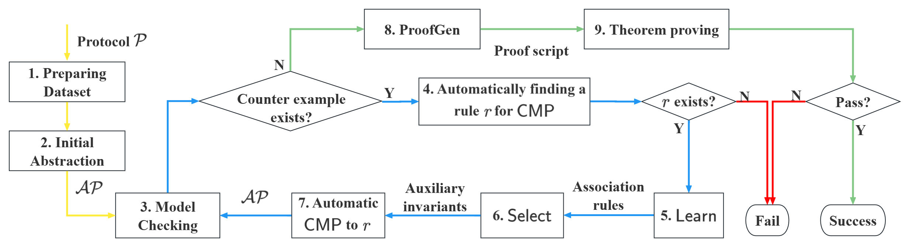
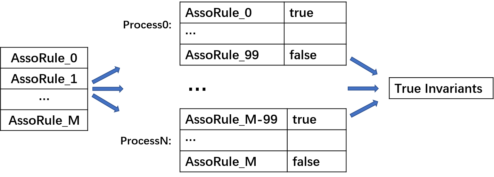

# RLCMP


## Introduction

---

RLCMP: A Framework Combing Machine Learning, Model-checking, Abstraction and Theorem Proving for Parameterized Verification


## Workflow

---

Firstly, we need to preprocess the protocol. At the end of the preprocessing, a data sheet $\mathit{AllDataSet}$ is prepared. After the pre-processing steps, our iterative learning-based CEGAR (counter-example guided refinement process) process to construct the abstract protocol starts, as illustrated in the figure below. 

1. Initially, we must preprocess the protocol under verification to create a data sheet suitable for learning.
    
2. Given the small protocol instance ${\cal P}(N)$ (usually $\mathit{N=3}$) in Murphi, we first abstract it into $\mathcal{AP}$ using the CMP method. In this abstraction, only $\mathit{M}$ (typically $\mathit{M=2}$) nodes are retained in the Murphi model, and an abstract node is employed to represent the behavior of all other nodes from $\mathit{M+1}$ to $\mathit{N}$.

3. $\mathcal{AP}$ is subsequently subjected to model checking by Murphi. If the verification result is positive, indicating that the required property has been proven for ${\cal P}(N)$, then our CEGAR process can be concluded. Otherwise, Murphi will produce a counter-example ${\it ce}$, presented in the form of a trace of executing the protocol rules of the abstract protocol in Murphi.
    
4. Given ${\it ce}$, our focus is on the protocol rules executed by the $\mathit{Other~}$node in ${\it ce}$. Among these rules, we select the first one that is abstracted without guard strengthening from some rule $\mathit{r}$ in the original protocol. If no such rule exists, the CEGAR process stops and returns an error message. It's important to note that the action of choosing the rule for strengthening is fully automatic.
    
5. According to the prepared data sheet ${\it AllDataSet}$ and the rule $\mathit{r}$, a small dataset can be extracted where each state satisfies the guard of the rule $\mathit{r}$. Using this small dataset, we apply an association rule learning algorithm to obtain a sufficient number of association rules, which will then be transformed into invariants. The extraction and learning actions described above are implemented in the procedure $\mathsf{Learn}$.
    
6. Due to the limitations of the dataset resulting from the small instance and the symmetry reduction techniques used in Murphi, the invariants learned in step learn may be incorrect for larger protocol instances. To address this issue, we can model check a larger protocol instance to eliminate these false invariants. Additionally, the CMP method itself aims to use as few invariants as possible, so only a small number of invariants need to be chosen from the large number of remaining invariants after the elimination of false ones. To accomplish this, several heuristics inspired by the CMP method itself are adopted to filter useful invariants for strengthening the rule $\mathit{r}$. Consequently, only a small number of high-quality auxiliary invariants are filtered out.

7. With the learned auxiliary invariants ${\it auxInvs}$, we strengthen the rule $\mathit{r}$ into $\mathsf{STR}_r$, then abstract $\mathsf{STR}_r$ into $\mathsf{ABS}_r$. This strengthening and abstraction process is implemented in the procedure $\mathsf{CMP}$. The $\mathsf{ABS}_r$ in $\mathcal{AP}$ is updated with the new value, and ${\it auxInvs}$ are added for verification. In other words, we obtain a refined abstracted protocol $\mathcal{AP}$ and then return to step $\mathsf{Model~checking}$ again. 

8. After the automatic CEGAR CMP-process is completed, a proof script is automatically generated by $\mathsf{proofGen}$ to certify the abstraction. This proof script is then verified in Isabelle/HOL. Finally, we can determine from the theorem prover whether the certification is successful.




## Requirement

---
### OS:

Ubuntu 20.04LTS

### Software:

1.  Cmurphi 5.5.0 http://mclab.di.uniroma1.it/site/index.php/software/18-cmurphi  
2.  Python 3.12.3  
3.  Lark 1.1.9
4.  Isabelle 2021 https://isabelle.in.tum.de/website-Isabelle2021/
 
Note that these programs runs on MAC or Linux system.

Since we used LFS to upload large files, it's necessary to use git lfs clone to download the files.
```
git lfs clone https://gitlab.com/Adolst/rlcmp.git
```

## Run an Example

---

1.  Download the program and libraries mentioned above.

2.  Modify the file settings.py, set the variables MU_PATH, MU_INCLUDE, GXX_PATH, which mean path of CMurphi, path of include directory of CMurphi and path of g++ compiler respectively. MU_FILE_DIR refers to when CMurphi is called to check protocol, a directory is created under MU_FILE_DIR to hold temporary files, and you can change it to where you want. MU_CHECK_MEMORY indicates how much memory you will allocate to the CMurphi program.

3. Run the file `python murphiGen.py --task MutualEx --simp n`, in which the 'MutualEx' can be replaced to another protocol name. It will automatically perform ILCMP work until ‘success!’ is displayed on the terminal.

4. Run the file `python proofGen.py --task MutualEx`, It will automatically generate proof script(for example, MutualEx.thy) in the `./protocol/`.

5. Open the `protocol.thy` in the Isabelle2021 and it will do the theorem proving automatically.


## Files

---

After step running the program, some files are generated under the path ./**prot**/. The **prot** represents the name of protocol you want to verify. A file named ABS**prot**.m will appear in the path, which is the final abstract protocol. In the meantime, the information about the strengthen process will be contained in **prot**.log. In addition, **prot**\_reach.txt is the reachable set of the protocol; **prot**\_reach.csv is also the reachable set of the protocol, except that it is represented as a CSV file; AllDataSet.csv is the extended reachable set, which corresponds to $\mathit{AllDataSet}$; assoRules is the directory contains association rules; auxInvs contains the auxiliary invariants selected from association rules. str_**prot**.m retains the result of the strengthen for each rule. Here we chose mutalEx as an example to illustrate these files.

### ABSMutualEx.m
The ABSprot.m is an abstraction of the original protocol. It contains the original and abstracted rules, as well as variable definitions, initializations, and invariants, etc.

### abs_process.csv
The abs_process.csv file records the protocol strengthening information, including which rules were strengthened and which lemmas were used in the process. Notice that these processes are recorded in sequence.
| Idle | Lemma_1 |
|:----:|:-------:|


As shown above, MutualEx is strengthened in order: "Store" is strengthened by auxInv_1, and "Idle" is strengthened by auxInv_2. Note that finally We collect all invariants with the the same antecedent $\mathit{ant}$ into a set $\mathit{INV}$, and merge them into $\mathit{ant \longrightarrow \bigwedge\{cons(f) \mid f \in INV \}}$ to make the protocol program more concise, so the auxInv_i represents 1 or more invariants after selection.

### MutualEx.log
MutualEx.log records the order in which the rules are strengthened, the time spent, and the number of association rules learned and auxiliary invariants used.

### str_MutualEx.m
str_MutualEx.m contains the original rules and the rule strengthened with auxiliary invariants.  

### MutualEx_reach.txt
MutualEx_reach.txt is the output file of Murphi, which is the reachable set of the protocol.  

### MutualEx_reach.csv
MutualEx_reach.csv is the reachable set represented in a CSV file. As shown in the following example. Each line represents a reachable state and the value of the variables.  
| n[NODE_1] | n[NODE_2] | x     |
|:---------:|:---------:|:-----:|
| I         | I         | true  |
| I         | T         | true  |
| I         | C         | false |
| T         | T         | true  |
| I         | E         | false |
| T         | C         | false |
| T         | E         | false |


 

### AllDataSet.csv
AllDataSet.csv extends variables from Prot.csv, where the first line is atomic predicates, and lines 2-8 are their Boolean values.
| n[NODE_1] = T | x = true | n[NODE_1] = I | n[NODE_2] = E | x = false | n[NODE_2] = I | n[NODE_2] = T | n[NODE_1] = E | n[NODE_1] = C | n[NODE_2] = C |
|:-------------:|:--------:|:-------------:|:-------------:|:---------:|:-------------:|:-------------:|:-------------:|:-------------:|:-------------:|
| False         | True     | True          | False         | False     | True          | False         | False         | False         | False         |
| False         | True     | True          | False         | False     | False         | True          | False         | False         | False         |
| False         | False    | True          | False         | True      | False         | False         | False         | False         | True          |
| True          | True     | False         | False         | False     | False         | True          | False         | False         | False         |
| False         | False    | True          | True          | True      | False         | False         | False         | False         | False         |
| True          | False    | False         | False         | True      | False         | False         | False         | False         | True          |
| True          | False    | False         | True          | True      | False         | False         | False         | False         | False         |


### assoRules
A directory contains the association rules for refining rules in Murphi learn from AllDataSet.

### auxInvs
A directory contains the auxiliary invariants selected from association rules by some heuristics.

### MutualEx.thy
A proof script generated with the information recorded in the abs_process.csv and ABSMutualEx.m.

## Tools for eliminating false invariants

---

Original Murphi tool has its limitation in supporting eliminating too many invariants.
- Murphi adopts the on-the-fly mode in which it will stop once an invariant is violated. 
    
- Murphi's compiler reports an  error when the number of invariants exceed some limit. Usually the  default number of invarints is small, 
less than 500. However, the number of learning invariants can exceed 10000.
    
- Since checking invariants also need time, Murphi will run extremely long when there are too many invariants to be checked in each reachable state.

Therefore,we have developed a extension of Murphi, and the association rules are checked in parallel with multi-process.

### Extended Murphi
we extend Murphi to work in a mode in which it stops until all invariants are checked to be false or all reachable states are enumerated, 
and the invariants which fails in model checking are listed in output. The source code of the tool is in the submodule cmurphi5.5.0-v1_hid.

### Check the association rules in parallel
Besides,  a hundred of association rules are transformed into invariants and formed as a group and subjected to model checking, which is executed in a spawn of process of executing Murphi; and all invariants are divided into groups and model checked by many processes 
in parallel. The source code is in file call_murphi.py.


## How to select auxiliary invariants from association rules

---

As an example, in the process of refining rule ``Idle" of MutualEx, we obtained the following association rules by learning(the complete set of association rules is available in the path ./MutualEx/assoRules/assoRules_Idle.txt, and we've omitted the keyword **NODE** for convenience in the following code blocks). They can be transformed into equivalent invariants.

    inv_1 : x = false -> n[i] != C              /*assorule_1 : x = false -> n[2] != C*/

    inv_2 : n[i] = I -> n[j] = E                /*assorule_2 : n[1] = I -> n[2] = E*/

    inv_3 : n[i] = T -> n[j] = E                /*assorule_3 : n[1] = T -> n[2] = E*/

    inv_4 : n[i] = E -> n[i] != C               /*assorule_4 : n[2] = E -> n[2] != C*/

    inv_5 : n[i] = E & n[j] = I -> x = false    /*assorule_5 : n[2] = E & n[1] = I -> x = false*/

    inv_6 : n[i] = E -> x = false               /*assorule_6 : n[2] = E -> x = false*/

    inv_7 : n[i] = E -> n[j] != C               /*assorule_7 : n[2] = E -> n[1] != C*/

    inv_8 : n[i] = E -> n[j] != E               /*assorule_8 : n[2] = E -> n[1] != E*/
    
    ...


We extract dataset from $\mathit{AllDataSet}$ according to the predicate in guard of ``Idle"(i.e. $\mathit{n\[i\].st = E}$), so each entry in dataset satisfies the predicate. When a node state is $\mathsf{E}$, $\mathit{x}$ must be $\mathit{false}$, and another node state must be $\mathsf{I}$ or $\mathsf{T}$, this is why we can obtain the ${\it inv_1, inv_2, inv_3}$. However, they are not true, because in the whole reachable states set, the state of a node cannot be determined when $\mathit{x}$ is $\mathit{false}$, Similarly, when a node is in state $\mathsf{I}$ or $\mathsf{T}$, there is no way to determine the state of aother node. We use tools to eliminate false invariants and obtain:

    inv_4 : n[i] = E -> n[i] != C            /*assorule_4 : n[2] = E -> n[2] != C*/

    inv_5 : n[i] = E & n[j] = I -> x = false /*assorule_5 : n[2] = E & n[1] = I -> x = false*/

    inv_6 : n[i] = E -> x = false               /*assorule_6 : n[2] = E -> x = false*/

    inv_7 : n[i] = E -> n[j] != C          /*assorule_7 : n[2] = E -> n[1] != C*/

    inv_8 : n[i]. = E -> n[j] != E          /*assorule_8 : n[2] = E -> n[1] != E*/
    
    ...

These invariants are absolutely true. However,the first invarinat is completely redundant because a node has only one state at one point; As for the second invariant, ${\it n[j].st = I}$ doesn't occur in the guard of ``Idle", so it should be filtered out. After removing useless invariants, ${\it inv_6, inv_7, inv_8, inv_9}$ are left and merged into an invariant because they have the same antecedent. The heuristic for filtering invariants is in murphi_process.py, the result is stored in ./MutualEx/auxInvs/auxInvs_Idle.txt

    n[i].st = E -> x = false & n[i].data = auxData & n[j].st != C & n[j].st != E
        


## Result

---

The strategy of selecting rules is very effective. Here we select some auxiliary invariants of the rules to show the chages of number before and after the selection. More comparison are in the file reduction.md.
| Protocol        | Rule        | Association Rules   | Auxiliary invariants|
|-----------------|-------------|---------|-------|
| MutualEx | Idle        | 532     | 3     |
| German   | RecvInvAck1 | 33,573  | 7     |
| Flash    | NI_Remote_Get_Put | 585,144 | 35    |
| Flash    | PI_Remote_PutX | 680,748 | 20|
| Flash    | NI_Remote_GetX_Nak  | 622,305 | 25|
| Flash    | NI_Local_GetX_PutX2 | 662,894 | 22|


The following table show the experimental result. The statistics includes 7 types of data. #Asso is the number of learned association rules; #Aux is the number of auxiliary invariants; #STR_rules is the number of strengthened rules in CMP; Learn is the time spent in learning; Select is the the time spent in selecting invariants; Strengthen is the time spent on strengthening rules (including the parameterized abstraction and guard strengthening); Total is the total time taken for verification.
|                 | #Asso     | #Aux | #STR_Rules | Learn   | Select    | Strengthen | Total     |
|-----------------|-----------|------|------------|---------|-----------|------------|-----------|
| Mesi            | 0         | 0    | 0          | 0       | 0         | 0          | 2.96      |
| MutualEx | 532       | 3    | 1          | 0.01    | 2.82      | 0.01       | 8.64      |
| German   | 33,573    | 7    | 1          | 0.27    | 2.64      | 0.01       | 11.55       |
| Flash    | 6,340,218 | 257  | 10         | 139.13  | 908.23    | 1.56       | 1,147.21  |


We have verified Bus/Directory-based cache consistency protocols, including Flash protocol which is industrial-level. The CMP method of each protocol is also formally proved.The table below is about statistics for case studies. The \#rules column contains the total number of protocol rules. The \#lines is the number of lines in the generated Isabelle proof script, and the \#invariants is the number of invariants before merging. The column TP time' presents the time consumed by the theorem proving in Isabelle, while the column MC time' further indicates the amount of time spent on model checking the abstracted protocol.


| Protocol | #rules | #lines | #invariants | TP time (seconds) | MC time (seconds) |
|----------|--------|--------|-------------|-------------------|-------------------|
| Mesi     | 4      | 833    | 0           | 5.50              | 0.1               |
| MutualEx | 4      | 923    | 3           | 4.25              | 0.1               |
| German   | 12     | 2,443   | 7           | 39.37             | 0.1               |
| Flash    | 40     | 9,880   | 257         | 2,140.86           | 3.83              |
